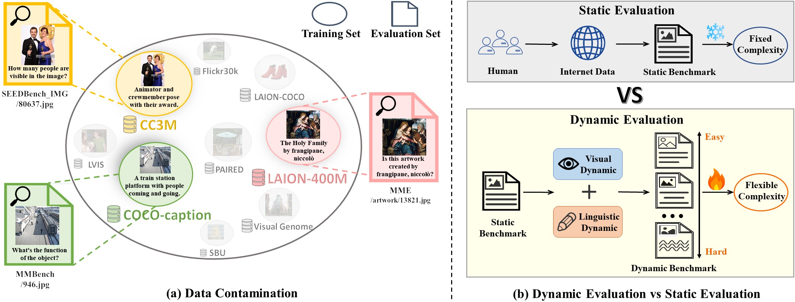
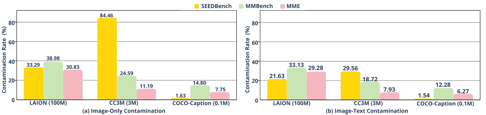
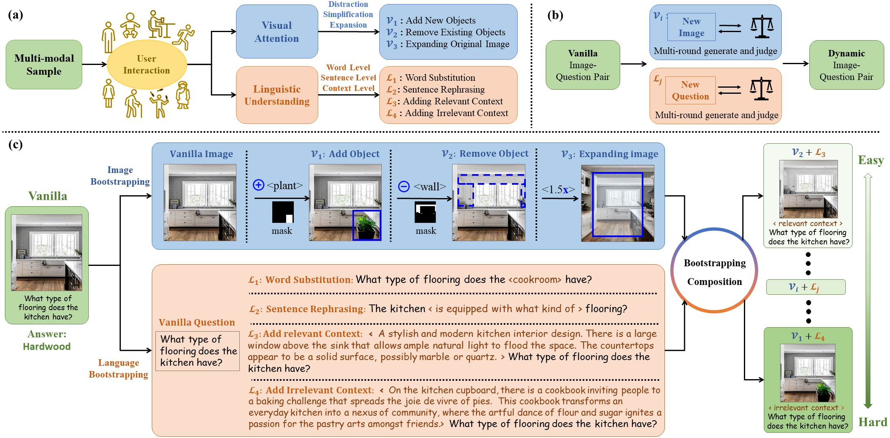

# Dynamic Multimodal Evaluation(DME)

<p align="left">
  <a href="https://arxiv.org/abs/2410.08695"><b>arXiv</b></a> |
  <a href="#🖊️-citation"><b>Citation</b></a> <br>
</p>


This repository is the official implementation of [DME](https://arxiv.org/abs/2404.16006). 

> Yue Yang, Shuibai Zhang, Wenqi Shao<sup>\#</sup>, Kaipeng Zhang<sup>\#</sup>, Yi Bin, Yu Wang, Ping Luo<sup>\#</sup>


## 💡 News


- `2024/12/31`: Opencompass [VLMEevalKit](https://github.com/open-compass/VLMEvalKit)  release supports some DME datas now!  You can use [VLMEevalKit](https://github.com/open-compass/VLMEvalKit) to try and visualize our dynamic datas.


## Introduction

LVLMs have demonstrated good performance on various multimodal evaluation benchmarks. However, these benchmarks keep a static nature and overlap with the pre-training data, resulting in fixed complexity constraints and data contamination issues. This raises the concern regarding the validity of the evaluation. 

To address these two challenges, we introduce a dynamic multimodal evaluation protocol called Vision-Language Bootstrapping (VLB). VLB provides a robust and comprehensive assessment for LVLMs with reduced data contamination and flexible complexity. To this end, VLB dynamically generates new visual question-answering samples through a multimodal bootstrapping module that modifies both images and language, while ensuring that newly generated samples remain consistent with the original ones by a judge module. By composing various bootstrapping strategies, VLB offers dynamic variants of existing benchmarks with diverse complexities, enabling the evaluation to co-evolve with the ever-evolving capabilities of LVLMs. 



## Data Contamination Rate of Existing Static Benchmarks

We explore two types of data contamination in multimodal evaluation benchmarks. 

**1) Image-only contamination.** We aim to detect how many images in the benchmark can be found in the pretraining data. To this end, we utilize CLIPScore to measure the similarity between images from the evaluation and training set. We adopt 0.9 as the threshold (the number we find high visual similarity) to determine visual contamination. 

**2) Image-text contamination.** Beyond images, the question and answer of the benchmark can also be contaminated. For contaminated image pairs, we determine the question and answer are contaminated if the answer can be directly inferred from the captions of the training image. 



We examine the two types of data contamination across three popular evaluation benchmarks: SEEDBench, MMBench, MME, and three widely used pre-training datasets: LAION-100M, CC3M, and COCO-Caption. The results reveal that each evaluation benchmark exhibits certain contamination rates across training datasets of various sizes.


## Framework of our Dynamic Multimodal Evaluation by Vision-Language Bootstrapping

- **(a)** demonstrates how we derive insights from real user interactions with LVLMs, where users possess different visual attention and language understanding from diverse identities. 

- **(b)** highlights the role of VLB’s judge module in ensuring that generated images and questions maintain consistent with the original. 

- **(c)** provides an example of VLB transforming a sample through image and language bootstrapping. Additionally, VLB can generate new, increasingly complex samples through bootstrapping composition.

- **Image Bootstrapping:**  we simulate disturbing or focusing visual attention for image bootstrapping: **Adding new objects (V1)**, **Removing existing objects (V2)**, and **Expanding original images (V3)**.

- **Language bootstrapping:** we stimulate different linguistic expressions of users with various identities and backgrounds. Four strategies from different levels of linguistic expressions: word level, sentence level, context level, are employed, namely **Word Substitution (L1)**, **Sentence Rephrasing (L2)**, **Adding Relevant Context (L3)**, **Adding Irrelevant Context (L4)**.

  




## Released Demo Datas

Based on LlavaBench and MMvet, we have curated two more challenging versions of the datasets: LlavaBench_hard and MMvet_hard. These are the hardest multimodal combinations **(V1+L4)** in our dynamic strategy. Thanks to the support from Opencompass [VLMEevalKit](https://github.com/open-compass/VLMEvalKit) , we have also integrated these datasets onto [VLMEevalKit](https://github.com/open-compass/VLMEvalKit)  for reference, usage, and visualization.


## 💐 Acknowledgement

We expressed sincerely gratitude for the projects listed following:

- [VLMEvalKit](https://github.com/open-compass/VLMEvalKit) provides useful out-of-box tools and implements many adavanced LVLMs. Thanks for their selfless dedication.


## 🖊️ Citation 

If you feel DME instructive for your research, please kindly use the following BibTeX entry to cite our paper. Thanks!

```
@article{yang2024dynamic,
  title={Dynamic Multimodal Evaluation with Flexible Complexity by Vision-Language Bootstrapping},
  author={Yang, Yue and Zhang, Shuibai and Shao, Wenqi and Zhang, Kaipeng and Bin, Yi and Wang, Yu and Luo, Ping},
  journal={arXiv preprint arXiv:2410.08695},
  year={2024}
}
```

